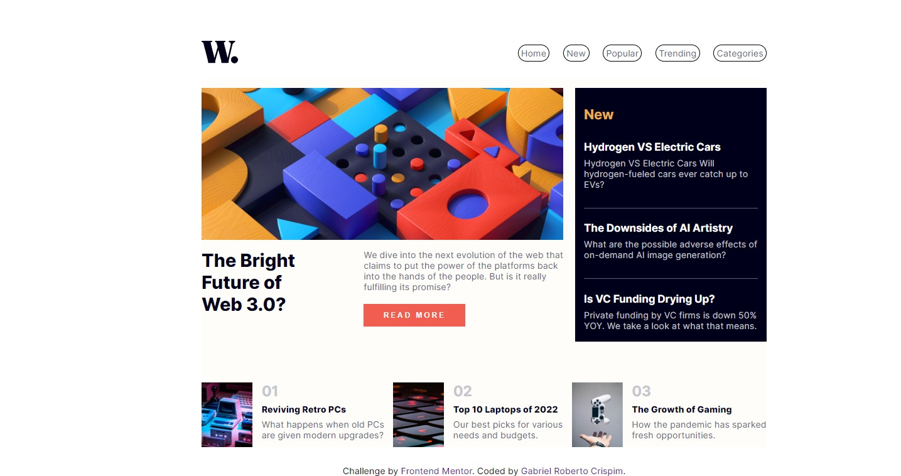

# Frontend Mentor - News homepage solution

This is a solution to the [News homepage challenge on Frontend Mentor](https://www.frontendmentor.io/challenges/news-homepage-H6SWTa1MFl). Frontend Mentor challenges help you improve your coding skills by building realistic projects. 

## Table of contents

- [Overview](#overview)
  - [The challenge](#the-challenge)
  - [Screenshot](#screenshot)
  - [Links](#links)
- [My process](#my-process)
  - [Built with](#built-with)
  - [What I learned](#what-i-learned)
  - [Continued development](#continued-development)
  - [Useful resources](#useful-resources)
- [Author](#author)


## Overview

### The challenge

Users should be able to:

- View the optimal layout for the interface depending on their device's screen size
- See hover and focus states for all interactive elements on the page

### Screenshot



### Links

- Solution URL: [Click Here](https://github.com/sirbiel100/Challenge--7)
- Live Site URL: [Click Here](https://sirbiel100.github.io/Challenge--7/)

## My process

### Built with

- Semantic HTML5 markup
- CSS custom properties
- Flexbox
- CSS Grid
- SCSS/SASS
- Javascript


### What I learned

This challenge was very useful to make me improve my CSS Grid and organize the div's using it. 

To see how you can add code snippets, see below:

```css
.proud-of-this-css {
  display: grid; 
}
```


### Continued development

I intend to keep going even more now that I finished my first challenge Junior level! I want to continue learning a lot of new things, such as React and typescript.


### Useful resources

- [TsbSankara](https://www.youtube.com/watch?v=gp9Ht5EKvSs&t=3336s) - And there he is again hahaha. He helped me a lot in this video with positions of div that I was stuck in.


## Author

- GitHub - [@sirbiel100](https://github.com/sirbiel100)
- Frontend Mentor - [@sirbiel100](https://www.frontendmentor.io)
- LinkedIn - [Gabriel Crispim](https://www.linkedin.com/in/gabriel-crispim-5b6945221/)

